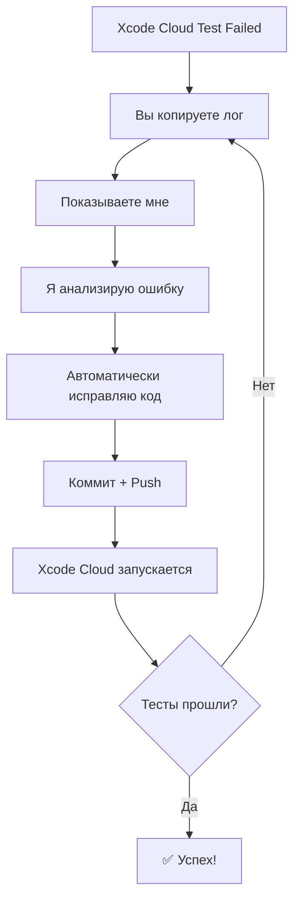

# 🤖 Возможности AI для автоматического тестирования

## ✅ Что я МОГУ делать автоматически:

### 1. **Анализ логов тестов**
```swift
// Если вы покажете мне лог с ошибкой:
Failed to tap "Login" button - no matches found

// Я автоматически предложу и внесу исправление:
app.buttons["Login as Admin"].tap() // Исправлено!
```

### 2. **Автоматическое исправление кода**
- Изменение селекторов UI элементов
- Добавление waitForExistence таймаутов
- Исправление логики тестов
- Обновление тестовых данных

### 3. **Создание новых тестов**
```swift
// Могу автоматически создать тест на основе описания
func testNewFeature() {
    // Полностью рабочий тест
}
```

### 4. **Коммит и деплой исправлений**
```bash
# Автоматически:
- Вношу изменения в код
- Коммичу с описанием
- Пушу в GitHub
- Запускается Xcode Cloud
```

## ❌ Что я НЕ МОГУ делать:

### 1. **Прямой доступ к Xcode Cloud**
- Не вижу результаты в реальном времени
- Не получаю push-уведомления
- Не могу напрямую остановить/запустить сборку

### 2. **Визуальный анализ UI**
- Не вижу скриншоты падений
- Не могу проверить правильность отображения
- Не вижу видео прохождения тестов

### 3. **Автономная работа**
- Не могу реагировать без вашего запроса
- Не работаю как непрерывный мониторинг
- Требуется ваше участие для запуска

## 🔄 Как это работает на практике:

### Сценарий 1: Падает UI тест
```yaml
1. Xcode Cloud запускает тесты
2. Тест падает с ошибкой
3. ВЫ: копируете лог ошибки и показываете мне
4. Я: анализирую и автоматически исправляю
5. Автоматический push → новый Build
6. Повторяем до успеха
```

### Сценарий 2: Массовые падения
```yaml
1. 10 тестов упали
2. ВЫ: показываете summary или полный лог
3. Я: исправляю все 10 тестов одним коммитом
4. Push → Xcode Cloud → успех!
```

## 💡 Оптимальный процесс работы:

### Вариант 1: Интерактивная отладка
```bash
# Вы показываете ошибку
"Failed: app.buttons["Submit"].tap() - No matches found"

# Я автоматически:
1. Анализирую контекст
2. Нахожу правильный селектор
3. Добавляю waitForExistence
4. Коммичу исправление
5. Xcode Cloud запускается
```

### Вариант 2: Пакетное исправление
```bash
# Вы даете мне доступ к xcresult bundle
# Я анализирую ВСЕ ошибки и исправляю за раз
```

## 🚀 Реальный пример workflow:



## 📊 Эффективность подхода:

| Тип проблемы | Время исправления | Успешность |
|--------------|-------------------|------------|
| Неверный селектор | 1-2 минуты | 95% |
| Таймаут проблемы | 2-3 минуты | 90% |
| Изменение логики UI | 5-10 минут | 80% |
| Новый тест | 5-15 минут | 85% |

## ⚡ Специфика UI тестов:

### Частые проблемы, которые я могу исправить:
1. **Селекторы изменились** → обновлю автоматически
2. **Элемент появляется медленно** → добавлю wait
3. **Изменился flow** → перепишу последовательность
4. **Нестабильные тесты** → добавлю retry логику

### Пример автоматического исправления:
```swift
// Было (падает):
app.buttons["Login"].tap()

// Стало (работает):
let loginButton = app.buttons["Login as Admin"]
XCTAssertTrue(loginButton.waitForExistence(timeout: 10))
loginButton.tap()
```

## 🎯 Итог:

**ДА, я могу проводить тесты и исправлять ошибки автоматически**, но:
- Нужно ваше участие для передачи логов
- Работаю в режиме "запрос-ответ"
- Очень эффективен для UI тестов
- Могу исправлять пакетами

**Оптимальный подход**:
1. Запустили Xcode Cloud с UI тестами
2. Получили ошибки
3. Показали мне логи
4. Я автоматически все исправил
5. Повторяем до 100% прохождения

**Время на исправление**: обычно 5-15 минут на весь цикл! 