# Архитектурные диаграммы LMS ЦУМ

## 📊 Диаграммы системы

### 1. Общая архитектура (C4 Context)

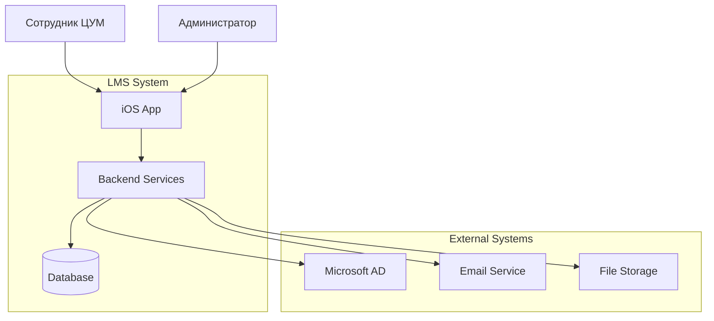

### 2. Микросервисная архитектура

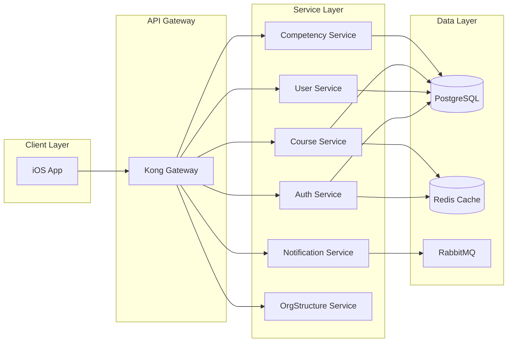

### 3. iOS Clean Architecture

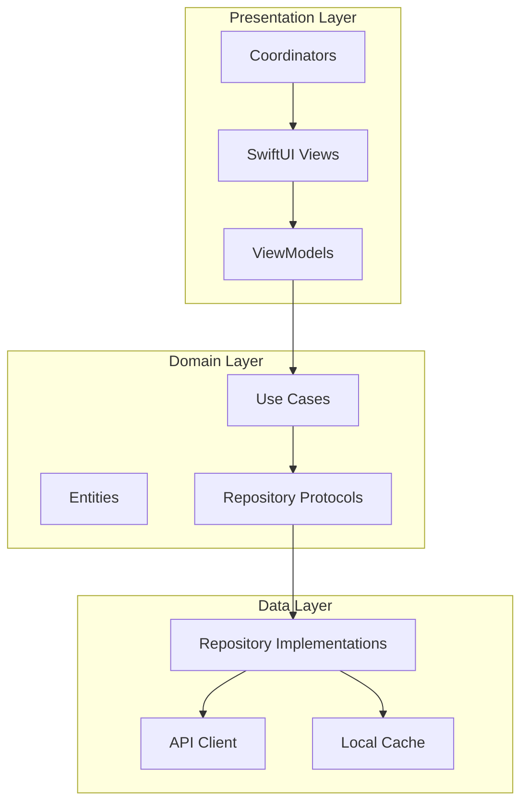

### 4. Поток аутентификации

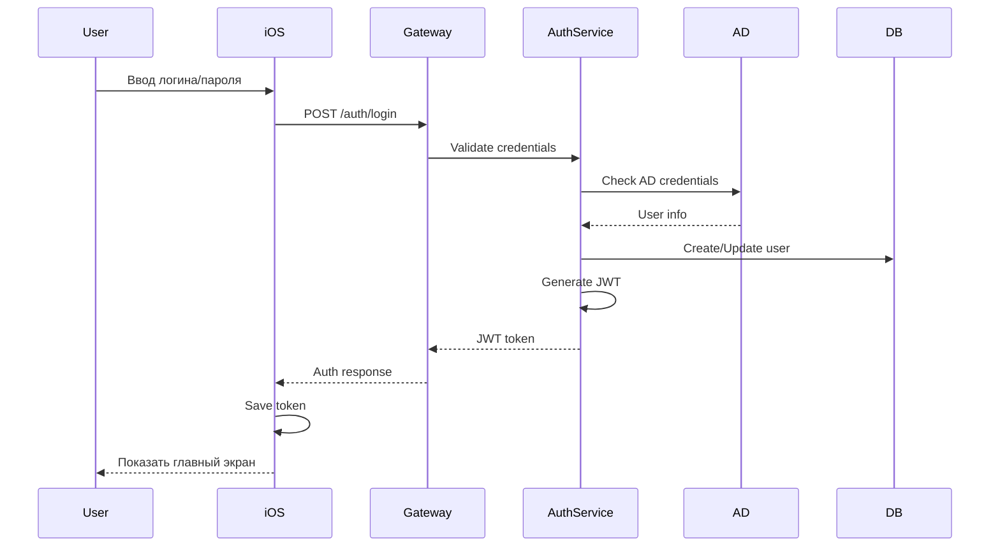

### 5. Структура базы данных

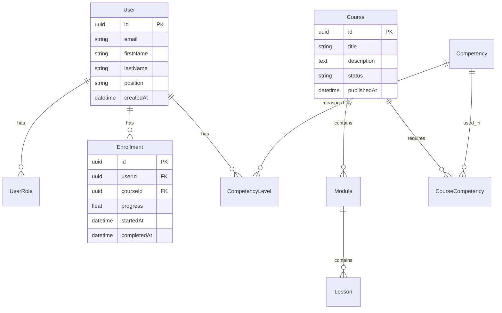

### 6. Процесс развертывания

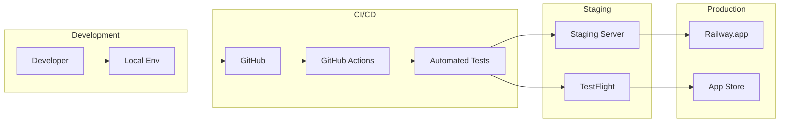

### 7. Модульная структура iOS

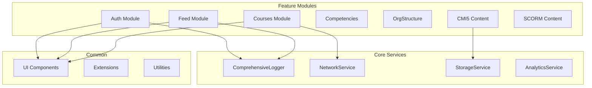

### 8. Жизненный цикл курса

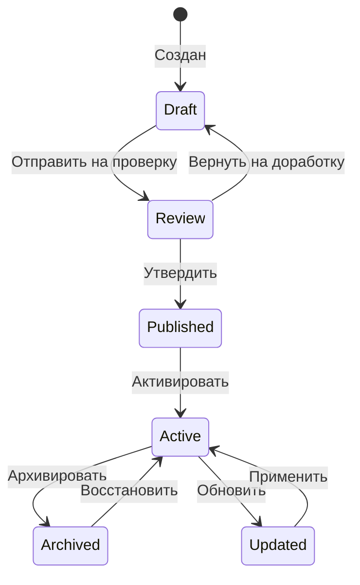

### 9. Процесс тестирования (TDD)

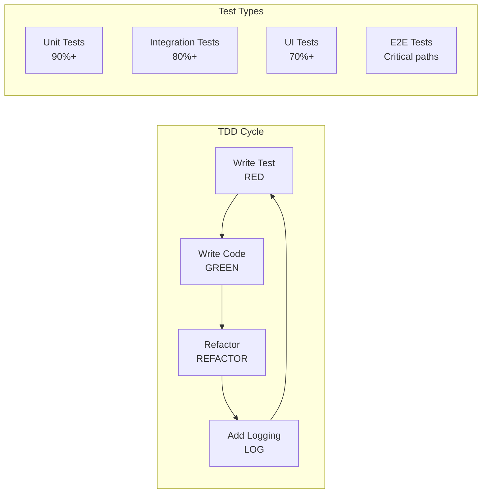

### 10. Система логирования

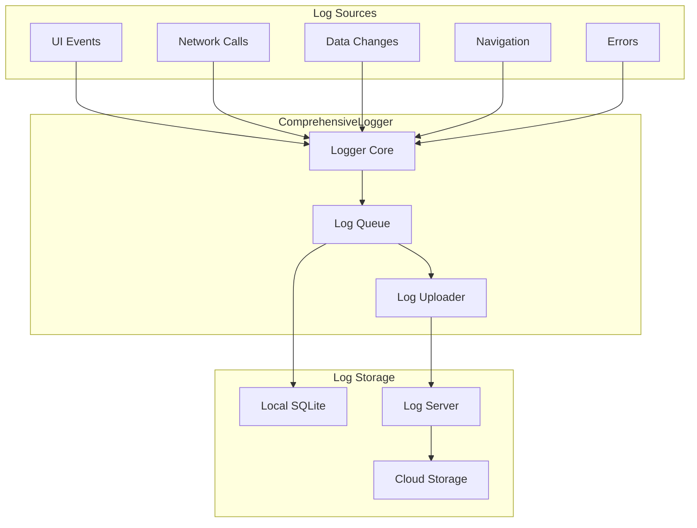

## 📈 Метрики и мониторинг

### Dashboard структура

```
┌─────────────────────────────────────────────────────┐
│                  LMS Dashboard                       │
├─────────────────┬───────────────┬──────────────────┤
│ Active Users     │ API Latency   │ Error Rate       │
│ 1,234           │ 45ms avg      │ 0.02%            │
├─────────────────┼───────────────┼──────────────────┤
│ Course Progress │ Test Coverage │ Build Status     │
│ 67% avg         │ 88.5%         │ ✅ Passing       │
├─────────────────┴───────────────┴──────────────────┤
│              Performance Graphs                      │
│  [CPU Usage Graph]    [Memory Graph]                │
│  [Network I/O Graph]  [Disk Usage Graph]            │
└─────────────────────────────────────────────────────┘
```

## 🔄 Процесс интеграции

### Feature Registry Flow

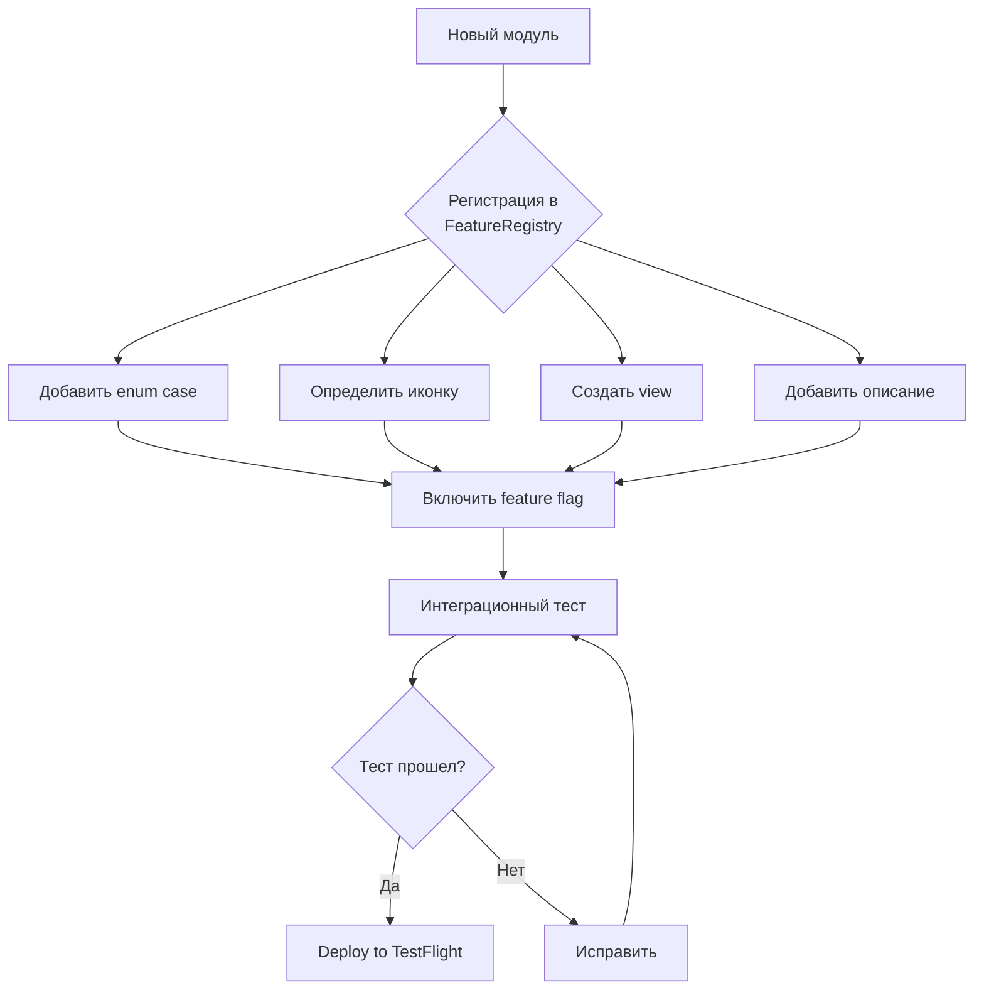

---

Эти диаграммы помогут новым участникам быстрее понять архитектуру системы и основные процессы разработки. 