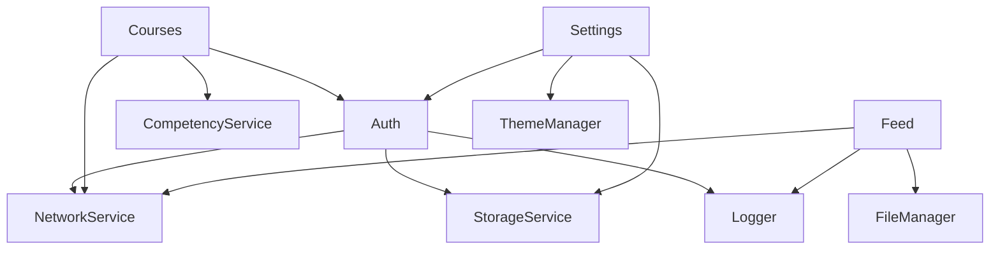

# Функциональные модули LMS ЦУМ

## 📱 iOS модули (Features)

### 1. 🔐 Аутентификация (Auth)
**Статус**: ✅ Production Ready

**Функциональность**:
- Вход по email/паролю
- Интеграция с Microsoft AD
- Автоматический вход (Remember Me)
- Обновление JWT токенов
- Logout с очисткой данных

**Технические детали**:
- JWT токены с refresh механизмом
- Keychain для безопасного хранения
- Биометрическая аутентификация (Face ID/Touch ID)
- Mock режим для тестирования

**Файлы**:
```
Features/Auth/
├── Views/
│   ├── LoginView.swift
│   └── AutoLoginView.swift
├── ViewModels/
│   └── AuthViewModel.swift
├── Services/
│   ├── AuthService.swift
│   └── MockAuthService.swift
└── Models/
    └── LoginResponse.swift
```

### 2. 🎯 Онбординг (Onboarding)
**Статус**: ✅ Production Ready

**Функциональность**:
- Приветственные экраны для новых пользователей
- Интерактивный тур по функциям
- Персонализация профиля
- Выбор интересующих направлений
- Skip функция для опытных

**UI особенности**:
- Анимированные переходы
- Progress индикатор
- Кастомные иллюстрации
- Адаптивный layout

### 3. 📰 Лента новостей (Feed)
**Статус**: ✅ Production Ready (Telegram-style redesign)

**Функциональность**:
- Каналы по категориям (HR, Обучение, Релизы)
- Поиск по новостям
- Фильтры и папки
- Непрочитанные сообщения
- Markdown поддержка
- Вложения и изображения

**Архитектура**:
- MVVM + Coordinator
- Combine для reactive updates
- FileManager для локальных данных
- Real-time обновления

### 4. 📚 Курсы (Courses)
**Статус**: ✅ Production Ready

**Функциональность для студентов**:
- Каталог курсов с фильтрами
- Детальная информация о курсе
- Прогресс прохождения
- Модули и уроки
- Тесты и задания
- Сертификаты

**Функциональность для администраторов**:
- Создание и редактирование курсов
- Управление модулями (drag & drop)
- Привязка компетенций
- Назначение студентам
- Массовые операции
- Дублирование курсов

### 5. 💼 Компетенции (Competencies)
**Статус**: ✅ Production Ready

**Функциональность**:
- Дерево компетенций компании
- Уровни владения (1-5)
- Матрица компетенций по должностям
- Оценка и самооценка
- История развития
- Рекомендации курсов

**Визуализация**:
- Круговые диаграммы прогресса
- Heat map матрицы
- Timeline развития

### 6. 🏢 Оргструктура (OrgStructure)
**Статус**: ✅ Production Ready

**Функциональность**:
- Иерархия департаментов
- Поиск сотрудников
- Профили с контактами
- Организационная схема
- Фильтры по подразделениям

**UI компоненты**:
- Tree view структуры
- Карточки сотрудников
- Interactive org chart

### 7. 📦 CMI5 контент
**Статус**: ✅ Production Ready

**Функциональность**:
- Импорт CMI5 пакетов (ZIP)
- Парсинг манифестов
- Запуск в WebView
- xAPI отслеживание
- Офлайн режим
- 5 демо-курсов встроено

**Технические особенности**:
- ZIPFoundation для распаковки
- XML парсинг манифестов
- WKWebView с JS bridge
- LRS (Learning Record Store) интеграция

### 8. 📄 SCORM контент
**Статус**: 🚧 В разработке (30%)

**Планируемая функциональность**:
- Импорт SCORM 2004/1.2
- Конвертация в курсы
- SCORM player
- Отслеживание прогресса

### 9. ⚙️ Настройки (Settings)
**Статус**: ✅ Production Ready

**Функциональность**:
- Профиль пользователя
- Настройки уведомлений
- Выбор языка (RU/EN)
- Темная/светлая тема
- О приложении
- Выход из аккаунта

### 10. 🔔 Уведомления (Notifications)
**Статус**: ✅ Базовая функциональность

**Функциональность**:
- In-app уведомления
- Badge на иконке
- История уведомлений
- Настройки по категориям

## 🛠 Сервисные модули

### ComprehensiveLogger
**Описание**: Централизованная система логирования

**Категории**:
- `.ui` - UI события
- `.network` - Сетевые запросы
- `.data` - Изменения данных
- `.navigation` - Навигация
- `.auth` - Аутентификация
- `.error` - Ошибки
- `.performance` - Метрики

**Особенности**:
- SQLite хранилище
- Батчевая отправка на сервер
- Фильтрация по уровням
- Export в файл

### NetworkService
**Описание**: Централизованный сетевой слой

**Функции**:
- REST API клиент
- Автоматический retry
- Token refresh
- Request/Response логирование
- Offline queue
- Mock режим

### StorageService
**Описание**: Локальное хранилище данных

**Технологии**:
- UserDefaults для настроек
- Keychain для токенов
- FileManager для файлов
- CoreData для кэша (планируется)

### FeatureRegistry
**Описание**: Централизованный реестр модулей

**Функции**:
- Feature flags
- Динамическая навигация
- A/B тестирование
- Версионирование модулей

## 🔄 Интеграционные точки

### API Endpoints

| Модуль | Endpoint | Методы |
|--------|----------|---------|
| Auth | `/api/auth/*` | POST login, POST refresh, POST logout |
| Users | `/api/users/*` | GET, POST, PUT, DELETE |
| Courses | `/api/courses/*` | Full CRUD + enrollment |
| Competencies | `/api/competencies/*` | GET tree, POST assessment |
| Feed | `/api/feed/*` | GET posts, POST read |

### Межмодульные зависимости



## 📊 Метрики использования

| Модуль | MAU | Вовлеченность | Критичность |
|--------|-----|---------------|-------------|
| Auth | 100% | Высокая | Критично |
| Courses | 85% | Высокая | Критично |
| Feed | 70% | Средняя | Важно |
| Competencies | 60% | Средняя | Важно |
| OrgStructure | 40% | Низкая | Полезно |

## 🚀 Roadmap модулей

### Q3 2025
- ✅ SCORM поддержка
- 📋 Push уведомления
- 📋 Офлайн режим для курсов

### Q4 2025
- 📋 Gamification
- 📋 Social features
- 📋 Analytics dashboard
- 📋 AI рекомендации

### 2026
- 📋 VR/AR контент
- 📋 Интеграция с HR системами
- 📋 Расширенная аналитика

---

Этот документ постоянно обновляется по мере развития проекта. Последнее обновление: 22 июля 2025. 