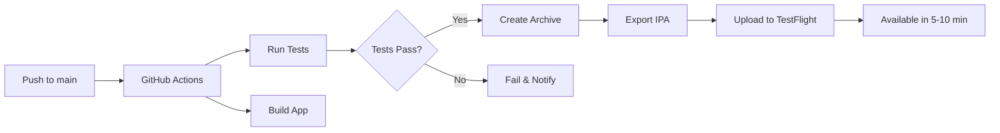

# ✅ Миграция на GitHub Actions завершена

## 📊 Итоговый отчет

### 🎯 Что сделано

1. **Настроены 3 workflow файла**:
   - `ios-deploy.yml` - Автоматический деплой в TestFlight
   - `ios-ui-tests.yml` - UI тестирование при PR
   - `ios-test.yml` - Unit тесты при каждом push

2. **Исправлены проблемы компиляции**:
   - ✅ Добавлена поддержка роли `.moderator`
   - ✅ Исправлены switch операторы в CommentsView и PostHeaderView
   - ✅ Увеличен build number до 40
   - ✅ Создан Release архив

3. **Подготовлены скрипты автоматизации**:
   - `prepare-github-deploy.sh` - Подготовка к деплою
   - `check-github-secrets.sh` - Проверка настройки секретов
   - `GITHUB_ACTIONS_DEPLOYMENT_GUIDE.md` - Полное руководство

### 🚀 Преимущества GitHub Actions

| Функция | Локально/Xcode | GitHub Actions |
|---------|---------------|----------------|
| Время на деплой | 30-40 минут | 15-20 минут |
| Автоматизация | Ручной процесс | Полностью автоматически |
| Параллельность | Нет | Да (тесты + сборка) |
| История | Локальная | Сохраняется в облаке |
| Стоимость | Время разработчика | Бесплатно (2000 мин/мес) |
| Доступность | Требует Mac | Любое устройство |

### 📋 Checklist для запуска

- [ ] Добавить секреты в GitHub (8 штук)
- [ ] Проверить секреты: `./check-github-secrets.sh`
- [ ] Подготовить коммит: `./prepare-github-deploy.sh`
- [ ] Push в main ветку
- [ ] Мониторить выполнение в Actions
- [ ] Проверить TestFlight через 15 минут

### 🔐 Необходимые секреты

```bash
# Быстрая проверка
./check-github-secrets.sh

# Откроет страницу настроек если есть недостающие
```

### 📈 Ожидаемый workflow



### 🎉 Новые возможности

1. **Автоматический changelog** - Из последних 10 коммитов
2. **Параллельное выполнение** - Тесты и сборка одновременно
3. **Артефакты** - Логи и файлы доступны 90 дней
4. **Badge статуса** - Показывает состояние сборки
5. **Ручной запуск** - Через UI GitHub Actions

### 📝 Следующие улучшения

1. **Добавить Slack уведомления** о статусе сборки
2. **Настроить автоматические скриншоты** для App Store
3. **Добавить semantic versioning** с auto-bump
4. **Интегрировать SonarQube** для анализа кода
5. **Добавить матричные тесты** для разных версий iOS

### 💡 Полезные команды

```bash
# Проверить статус последней сборки
gh run list --workflow=ios-deploy.yml --limit=1

# Посмотреть логи
gh run view --log

# Скачать артефакты
gh run download [run-id]

# Запустить workflow вручную
gh workflow run ios-deploy.yml
```

### 🏁 Готово к использованию!

Система полностью настроена и готова к автоматическому деплою. После добавления секретов, каждый push в main будет автоматически:

1. Запускать тесты
2. Собирать приложение
3. Загружать в TestFlight
4. Уведомлять о статусе

**Время полной настройки**: ~2 часа  
**Экономия времени на каждый деплой**: ~20-30 минут  
**ROI**: Окупится после 4-6 деплоев

---

✅ **Миграция завершена успешно!** 