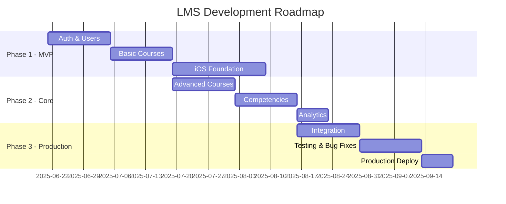

# Техническое задание на систему LMS "ЦУМ: Корпоративный университет"

**Версия документа**: 2.0  
**Дата**: 22 июля 2025  
**Статус**: Актуальная версия  
**Классификация**: Для внутреннего использования

## Содержание

1. [Общие положения](#1-общие-положения)
2. [Назначение системы](#2-назначение-системы)
3. [Требования к системе](#3-требования-к-системе)
4. [Функциональные требования](#4-функциональные-требования)
5. [Нефункциональные требования](#5-нефункциональные-требования)
6. [Требования к интерфейсу](#6-требования-к-интерфейсу)
7. [Архитектурные требования](#7-архитектурные-требования)
8. [Требования к безопасности](#8-требования-к-безопасности)
9. [Требования к интеграции](#9-требования-к-интеграции)
10. [Требования к производительности](#10-требования-к-производительности)
11. [Требования к надежности](#11-требования-к-надежности)
12. [Этапы разработки](#12-этапы-разработки)
13. [Критерии приемки](#13-критерии-приемки)

## 1. Общие положения

### 1.1. Наименование системы
**Полное**: Система управления обучением "ЦУМ: Корпоративный университет"  
**Краткое**: LMS ЦУМ  
**Кодовое**: LMS-TSUM

### 1.2. Заказчик
**Организация**: ЦУМ (Центральный Универсальный Магазин)  
**Подразделение**: HR департамент  
**Контактное лицо**: [Конфиденциально]

### 1.3. Исполнитель
**Организация**: [Команда разработки]  
**Методология**: Agile/Scrum + TDD  
**Подход**: LLM-оптимизированная разработка

### 1.4. Сроки реализации
**Начало проекта**: 21 июня 2025  
**Плановое завершение MVP**: 31 августа 2025  
**Production release**: 15 сентября 2025

### 1.5. Нормативные ссылки
- ГОСТ 34.602-89 "Техническое задание на создание автоматизированной системы"
- ISO/IEC 25010:2011 "Модели качества систем и программных продуктов"
- SCORM 2004 4th Edition
- CMI5 Specification v1.0
- xAPI v1.0.3

## 2. Назначение системы

### 2.1. Цели создания системы

1. **Автоматизация процессов обучения**
   - Централизованное управление учебными материалами
   - Автоматическое отслеживание прогресса
   - Формирование отчетности

2. **Повышение качества подготовки персонала**
   - Стандартизация обучающих программ
   - Контроль усвоения материала
   - Персонализированные траектории обучения

3. **Управление компетенциями**
   - Формирование матрицы компетенций
   - Оценка уровня владения
   - Gap-анализ и рекомендации

4. **Снижение затрат на обучение**
   - Сокращение времени на организацию
   - Минимизация очных занятий
   - Масштабируемость решения

### 2.2. Задачи системы

1. **Для сотрудников**:
   - Прохождение обязательных курсов
   - Развитие профессиональных навыков
   - Получение сертификатов
   - Отслеживание личного прогресса

2. **Для руководителей**:
   - Контроль обучения подчиненных
   - Назначение курсов
   - Анализ компетенций команды
   - Планирование развития

3. **Для HR департамента**:
   - Управление контентом
   - Формирование отчетов
   - Анализ эффективности
   - Compliance контроль

4. **Для администраторов**:
   - Техническое обслуживание
   - Управление пользователями
   - Интеграция с внешними системами
   - Мониторинг работоспособности

## 3. Требования к системе

### 3.1. Требования к структуре системы

Система должна состоять из следующих подсистем:

1. **iOS мобильное приложение** (основной канал)
2. **Backend микросервисы**
3. **База данных**
4. **Система хранения файлов**
5. **API Gateway**
6. **Система мониторинга**

### 3.2. Требования к режимам функционирования

1. **Онлайн режим** - полная функциональность
2. **Офлайн режим** - просмотр загруженного контента
3. **Maintenance режим** - техническое обслуживание
4. **Emergency режим** - минимальная функциональность

### 3.3. Требования к численности пользователей

- **Общее количество**: до 5,000 пользователей
- **Одновременно активных**: до 500 пользователей
- **Пиковая нагрузка**: до 1,000 пользователей/час
- **Рост**: 20% в год

## 4. Функциональные требования

### 4.1. Модуль аутентификации и авторизации

#### 4.1.1. Вход в систему
- Аутентификация по email/паролю
- Интеграция с Microsoft Active Directory
- Single Sign-On (SSO)
- Биометрическая аутентификация (Face ID/Touch ID)
- Автоматическое продление сессии
- Remember Me функция

#### 4.1.2. Управление правами
- Ролевая модель (RBAC)
- Иерархия ролей:
  - Суперадминистратор
  - Администратор
  - Контент-менеджер
  - Преподаватель
  - Руководитель
  - Сотрудник
- Делегирование прав
- Временные полномочия

### 4.2. Модуль управления пользователями

#### 4.2.1. Профиль пользователя
- ФИО, должность, подразделение
- Фотография профиля
- Контактная информация
- История обучения
- Достижения и сертификаты
- Личные настройки

#### 4.2.2. Управление пользователями
- CRUD операции
- Массовый импорт из CSV/Excel
- Синхронизация с AD
- Деактивация аккаунтов
- История изменений

### 4.3. Модуль управления курсами

#### 4.3.1. Структура курса
```
Курс
├── Описание курса
│   ├── Название
│   ├── Описание
│   ├── Цели обучения
│   ├── Требования
│   └── Длительность
├── Модули
│   ├── Модуль 1
│   │   ├── Урок 1.1
│   │   ├── Урок 1.2
│   │   └── Тест модуля
│   └── Модуль N
├── Материалы
│   ├── Видео
│   ├── Документы
│   └── Ссылки
├── Задания
│   ├── Практические
│   └── Тесты
└── Сертификат
```

#### 4.3.2. Типы контента
1. **Видео материалы**
   - Поддержка MP4, MOV
   - Streaming через HLS
   - Субтитры (VTT)
   - Контроль скорости воспроизведения

2. **Текстовые материалы**
   - PDF документы
   - HTML страницы
   - Markdown поддержка
   - Встроенный просмотр

3. **Интерактивный контент**
   - CMI5 пакеты
   - SCORM 1.2/2004
   - xAPI tracking
   - H5P контент

4. **Тестирование**
   - Множественный выбор
   - Единственный выбор
   - Соответствие
   - Эссе
   - Drag & Drop

#### 4.3.3. Управление курсами
- Создание и редактирование
- Версионирование контента
- Drag & Drop для модулей
- Предпросмотр курса
- Публикация и архивация
- Дублирование курсов
- Массовые операции

### 4.4. Модуль прохождения обучения

#### 4.4.1. Каталог курсов
- Поиск и фильтрация
- Категоризация
- Рекомендации
- Популярные курсы
- Новые поступления

#### 4.4.2. Процесс обучения
- Запись на курс
- Последовательное прохождение
- Сохранение прогресса
- Закладки
- Заметки к урокам
- Возобновление с места остановки

#### 4.4.3. Контроль знаний
- Промежуточное тестирование
- Финальный экзамен
- Пересдачи
- Ограничение попыток
- Рандомизация вопросов

### 4.5. Модуль компетенций

#### 4.5.1. Структура компетенций
```
Компетенции компании
├── Корпоративные
│   ├── Клиентоориентированность
│   ├── Командная работа
│   └── Результативность
├── Управленческие
│   ├── Лидерство
│   ├── Планирование
│   └── Делегирование
└── Профессиональные
    ├── По должностям
    └── По направлениям
```

#### 4.5.2. Оценка компетенций
- Уровни владения (1-5)
- Самооценка
- Оценка руководителем
- 360° оценка
- История изменений
- Целевые уровни

#### 4.5.3. Развитие компетенций
- Gap-анализ
- Индивидуальный план развития
- Рекомендуемые курсы
- Tracking прогресса
- Уведомления о достижениях

### 4.6. Модуль отчетности и аналитики

#### 4.6.1. Отчеты для руководителей
- Прогресс команды
- Завершенные курсы
- Средний балл
- Уровень компетенций
- Сравнение с другими подразделениями

#### 4.6.2. HR отчеты
- Общая статистика обучения
- Эффективность курсов
- Вовлеченность сотрудников
- Compliance отчеты
- ROI обучения

#### 4.6.3. Индивидуальные отчеты
- Личный прогресс
- История обучения
- Полученные сертификаты
- График развития компетенций
- Достижения

### 4.7. Модуль коммуникаций

#### 4.7.1. Лента новостей
- Объявления от HR
- Новые курсы
- Достижения коллег
- Изменения в программах
- Фильтрация по категориям

#### 4.7.2. Уведомления
- Push-уведомления
- In-app уведомления
- Email уведомления
- Настройка предпочтений
- История уведомлений

#### 4.7.3. Обратная связь
- Оценка курсов
- Комментарии к урокам
- Предложения по улучшению
- Техническая поддержка
- FAQ раздел

### 4.8. Административный модуль

#### 4.8.1. Dashboard администратора
- Ключевые метрики
- Активные пользователи
- Популярные курсы
- Системные события
- Ошибки и проблемы

#### 4.8.2. Управление контентом
- Модерация материалов
- Управление категориями
- Настройка метаданных
- SEO оптимизация
- Управление файлами

#### 4.8.3. Системные настройки
- Конфигурация интеграций
- Настройка ролей
- Шаблоны уведомлений
- Брендинг приложения
- Лимиты и ограничения

## 5. Нефункциональные требования

### 5.1. Требования к удобству использования

1. **Интуитивность**
   - Обучение использованию < 30 минут
   - Контекстные подсказки
   - Онбординг для новых пользователей
   - Единообразие интерфейса

2. **Доступность**
   - Поддержка VoiceOver/TalkBack
   - Увеличение шрифта
   - Контрастные темы
   - Соответствие WCAG 2.1 AA

3. **Локализация**
   - Русский язык (основной)
   - Английский язык
   - Возможность добавления языков

### 5.2. Требования к надежности

1. **Доступность системы**
   - Uptime: 99.5% (не более 44 часов простоя в год)
   - Плановое обслуживание: не более 4 часов/месяц
   - Уведомление за 48 часов

2. **Восстановление**
   - RTO (Recovery Time Objective): 4 часа
   - RPO (Recovery Point Objective): 1 час
   - Автоматическое восстановление сервисов

3. **Резервное копирование**
   - Ежедневное полное копирование
   - Инкрементальное каждые 4 часа
   - Хранение 30 дней
   - Геораспределенные копии

### 5.3. Требования к безопасности

1. **Аутентификация**
   - Многофакторная аутентификация
   - Политика паролей (мин. 8 символов)
   - Блокировка после 5 неудачных попыток
   - Session timeout: 8 часов

2. **Шифрование**
   - TLS 1.3 для передачи данных
   - AES-256 для хранения
   - Шифрование базы данных
   - Secure key management

3. **Аудит**
   - Логирование всех действий
   - Хранение логов 1 год
   - Защита от изменения логов
   - Real-time мониторинг подозрительной активности

### 5.4. Требования к совместимости

1. **iOS приложение**
   - iOS 17.0+
   - iPhone 12 и новее
   - iPad (6-го поколения) и новее
   - Оптимизация для разных размеров экранов

2. **Backend совместимость**
   - RESTful API
   - JSON формат данных
   - OpenAPI 3.0 спецификация
   - Версионирование API

## 6. Требования к интерфейсу

### 6.1. Требования к пользовательскому интерфейсу

1. **Дизайн-система**
   - Соответствие Apple Human Interface Guidelines
   - Фирменные цвета ЦУМ
   - Системные шрифты iOS
   - Темная и светлая темы

2. **Навигация**
   - Tab bar для основных разделов
   - Максимум 3 уровня вложенности
   - Breadcrumbs где необходимо
   - Поиск доступен везде

3. **Адаптивность**
   - Portrait и Landscape ориентации
   - Split View на iPad
   - Dynamic Type поддержка
   - Разные layouts для размеров экранов

### 6.2. Экраны приложения

#### 6.2.1. Структура навигации
```
TabBar
├── Главная
│   ├── Dashboard
│   ├── Рекомендации
│   └── Продолжить обучение
├── Каталог
│   ├── Все курсы
│   ├── Категории
│   └── Поиск
├── Мои курсы
│   ├── Активные
│   ├── Завершенные
│   └── Запланированные
├── Лента
│   ├── Новости
│   ├── Объявления
│   └── Достижения
└── Еще
    ├── Профиль
    ├── Компетенции
    ├── Сертификаты
    ├── Настройки
    └── О приложении
```

#### 6.2.2. Ключевые экраны

1. **Экран входа**
   - Логотип ЦУМ
   - Поля email/пароль
   - Кнопка входа
   - Восстановление пароля
   - Вход через AD

2. **Главный экран**
   - Приветствие пользователя
   - Прогресс обучения
   - Быстрые действия
   - Рекомендуемые курсы
   - Последние новости

3. **Каталог курсов**
   - Сетка/список курсов
   - Фильтры и сортировка
   - Поисковая строка
   - Категории
   - Badges для новых/популярных

4. **Карточка курса**
   - Обложка курса
   - Описание и цели
   - Программа курса
   - Отзывы и рейтинг
   - Кнопка записи

5. **Экран обучения**
   - Видео/контент область
   - Навигация по урокам
   - Прогресс бар
   - Заметки
   - Полноэкранный режим

## 7. Архитектурные требования

### 7.1. Общая архитектура

```
┌─────────────────────────────────────────────────────────┐
│                    Client Layer                          │
├─────────────────────────────────────────────────────────┤
│                 iOS App (Swift/SwiftUI)                  │
│              Clean Architecture + MVVM-C                 │
└────────────────────────┬────────────────────────────────┘
                         │ HTTPS
┌────────────────────────┴────────────────────────────────┐
│                   API Gateway Layer                      │
├─────────────────────────────────────────────────────────┤
│                    Kong Gateway                          │
│          Rate Limiting, Auth, Routing, Logging          │
└────────────────────────┬────────────────────────────────┘
                         │
┌────────────────────────┴────────────────────────────────┐
│                  Microservices Layer                     │
├─────────────────────────────────────────────────────────┤
│  ┌─────────────┐ ┌─────────────┐ ┌─────────────┐      │
│  │Auth Service │ │User Service │ │Course Service│ ...  │
│  └─────────────┘ └─────────────┘ └─────────────┘      │
│         PHP 8.1+ / Symfony 7.0 / DDD                    │
└────────────────────────┬────────────────────────────────┘
                         │
┌────────────────────────┴────────────────────────────────┐
│                    Data Layer                            │
├─────────────────────────────────────────────────────────┤
│  PostgreSQL 15+  │  Redis Cache  │  RabbitMQ  │  S3    │
└─────────────────────────────────────────────────────────┘
```

### 7.2. Микросервисы

| Сервис | Ответственность | Технологии |
|--------|-----------------|------------|
| Auth Service | Аутентификация, JWT, Sessions | PHP, Redis |
| User Service | Профили, роли, права | PHP, PostgreSQL |
| Course Service | Курсы, модули, контент | PHP, PostgreSQL, S3 |
| Competency Service | Компетенции, оценки | PHP, PostgreSQL |
| Notification Service | Push, Email, In-app | PHP, RabbitMQ |
| Analytics Service | Отчеты, метрики | PHP, ClickHouse |

### 7.3. Технологический стек

#### 7.3.1. iOS приложение
```yaml
Platform: iOS 17.0+
Language: Swift 5.9
UI Framework: SwiftUI
Architecture: Clean Architecture + MVVM-C
Networking: URLSession + Combine
Storage: UserDefaults + Keychain + FileManager
Dependencies: SPM
Testing: XCTest + ViewInspector
Analytics: Custom ComprehensiveLogger
```

#### 7.3.2. Backend
```yaml
Language: PHP 8.1+
Framework: Symfony 7.0
Architecture: Domain-Driven Design
API: RESTful + OpenAPI 3.0
Database: PostgreSQL 15+
Cache: Redis 7.0+
Queue: RabbitMQ 3.11+
Storage: S3-compatible
Container: Docker
Orchestration: Kubernetes
```

### 7.4. Интеграции

1. **Microsoft Active Directory**
   - LDAP/SAML протокол
   - Синхронизация пользователей
   - Single Sign-On
   - Группы и роли

2. **Email сервис**
   - SMTP интеграция
   - Шаблоны писем
   - Tracking открытий
   - Unsubscribe механизм

3. **Push уведомления**
   - Apple Push Notification Service
   - Rich notifications
   - Silent push
   - Группировка уведомлений

4. **Файловое хранилище**
   - S3-compatible API
   - CDN для статики
   - Прямая загрузка
   - Оптимизация изображений

## 8. Требования к безопасности

### 8.1. Защита данных

1. **Классификация данных**
   - Публичные: описания курсов, новости
   - Внутренние: учебные материалы, отчеты
   - Конфиденциальные: персональные данные, оценки
   - Критичные: пароли, токены, ключи

2. **Меры защиты по классам**
   - Публичные: CDN, кэширование
   - Внутренние: авторизация, логирование
   - Конфиденциальные: шифрование, ограничение доступа
   - Критичные: HSM, key rotation, audit

### 8.2. Контроль доступа

1. **Принципы**
   - Least privilege
   - Separation of duties
   - Need to know
   - Defense in depth

2. **Реализация**
   - JWT токены с коротким TTL
   - Refresh токены с ротацией
   - IP whitelisting для админов
   - Device fingerprinting

### 8.3. Защита от атак

1. **Сетевой уровень**
   - DDoS защита
   - Rate limiting
   - WAF (Web Application Firewall)
   - Geo-blocking при необходимости

2. **Приложение**
   - OWASP Top 10 compliance
   - Input validation
   - Output encoding
   - CSRF токены
   - Security headers

3. **Мониторинг**
   - IDS/IPS системы
   - Anomaly detection
   - Security scanning
   - Penetration testing (ежеквартально)

## 9. Требования к интеграции

### 9.1. API спецификация

```yaml
openapi: 3.0.0
info:
  title: LMS ЦУМ API
  version: 1.0.0
  description: API для системы управления обучением

servers:
  - url: https://api.lms.tsum.ru/v1
    description: Production server
  - url: https://staging-api.lms.tsum.ru/v1
    description: Staging server

security:
  - bearerAuth: []

paths:
  /auth/login:
    post:
      summary: Аутентификация пользователя
      requestBody:
        required: true
        content:
          application/json:
            schema:
              type: object
              properties:
                email:
                  type: string
                  format: email
                password:
                  type: string
                  format: password
      responses:
        200:
          description: Успешная аутентификация
          content:
            application/json:
              schema:
                type: object
                properties:
                  access_token:
                    type: string
                  refresh_token:
                    type: string
                  expires_in:
                    type: integer
```

### 9.2. Форматы данных

1. **JSON Schema**
```json
{
  "$schema": "http://json-schema.org/draft-07/schema#",
  "type": "object",
  "properties": {
    "id": {
      "type": "string",
      "format": "uuid"
    },
    "createdAt": {
      "type": "string",
      "format": "date-time"
    },
    "updatedAt": {
      "type": "string",
      "format": "date-time"
    }
  }
}
```

2. **Стандарты**
   - UUID v4 для идентификаторов
   - ISO 8601 для дат
   - UTF-8 кодировка
   - camelCase для полей JSON

### 9.3. Webhooks

```yaml
События:
  - user.created
  - user.updated
  - course.completed
  - certificate.issued
  - competency.assessed

Формат:
  method: POST
  headers:
    X-Webhook-Signature: HMAC-SHA256
    Content-Type: application/json
  body:
    event: string
    timestamp: ISO8601
    data: object
```

## 10. Требования к производительности

### 10.1. Время отклика

| Операция | Требование | Критично |
|----------|------------|----------|
| Загрузка приложения | < 2 сек | < 3 сек |
| Переход между экранами | < 0.5 сек | < 1 сек |
| Поиск | < 1 сек | < 2 сек |
| Загрузка видео (старт) | < 3 сек | < 5 сек |
| API запросы | < 500 мс | < 1 сек |

### 10.2. Пропускная способность

| Метрика | Требование |
|---------|------------|
| Одновременных пользователей | 500 |
| Запросов в секунду (RPS) | 1000 |
| Concurrent видео streams | 100 |
| Загрузок файлов/час | 500 |

### 10.3. Масштабируемость

1. **Горизонтальное масштабирование**
   - Stateless микросервисы
   - Load balancing
   - Auto-scaling policies
   - Database sharding ready

2. **Вертикальное масштабирование**
   - Resource limits настроены
   - Мониторинг потребления
   - Capacity planning
   - Performance profiling

### 10.4. Оптимизация

1. **Кэширование**
   - CDN для статики
   - Redis для сессий
   - HTTP кэш headers
   - Offline mode в приложении

2. **Оптимизация контента**
   - Lazy loading
   - Image optimization
   - Video adaptive bitrate
   - Compression (gzip/brotli)

## 11. Требования к надежности

### 11.1. Отказоустойчивость

1. **Уровень приложения**
   - Graceful degradation
   - Circuit breakers
   - Retry mechanisms
   - Fallback strategies

2. **Уровень инфраструктуры**
   - Multi-AZ deployment
   - Database replication
   - Queue persistence
   - Backup connectivity

### 11.2. Мониторинг

1. **Метрики**
   - CPU, Memory, Disk, Network
   - Response time, Error rate
   - Business metrics
   - User activity

2. **Инструменты**
   - Prometheus + Grafana
   - ELK Stack для логов
   - APM (Application Performance Monitoring)
   - Synthetic monitoring

3. **Алертинг**
   - Critical: немедленно
   - High: 15 минут
   - Medium: 1 час
   - Low: ежедневный дайджест

### 11.3. Disaster Recovery

1. **План восстановления**
   - Документированные процедуры
   - Роли и ответственности
   - Контакты и эскалация
   - Регулярные учения

2. **Backup стратегия**
   - 3-2-1 правило
   - Автоматическое тестирование
   - Версионирование
   - Шифрование backups

## 12. Этапы разработки

### 12.1. Roadmap



### 12.2. Спринты (2 недели каждый)

1. **Sprints 1-10**: Базовая инфраструктура
2. **Sprints 11-20**: Core функциональность
3. **Sprints 21-30**: Расширенные возможности
4. **Sprints 31-40**: Интеграции и оптимизация
5. **Sprints 41-50**: Микросервисы и масштабирование
6. **Sprints 51-55**: Production подготовка

### 12.3. Milestones

| Milestone | Дата | Результат |
|-----------|------|-----------|
| M1: Auth Ready | 05.07.2025 | Работающая аутентификация |
| M2: Course Viewing | 19.07.2025 | Просмотр курсов |
| M3: Full Learning | 02.08.2025 | Полный цикл обучения |
| M4: Production Ready | 30.08.2025 | Готовность к запуску |
| M5: Go Live | 15.09.2025 | Запуск в production |

## 13. Критерии приемки

### 13.1. Функциональные критерии

1. **Покрытие требований**
   - 100% обязательных требований
   - 80% желательных требований
   - Documented отклонения

2. **Качество**
   - 0 критических багов
   - < 5 major багов
   - < 20 minor багов

### 13.2. Технические критерии

1. **Тестирование**
   - Unit tests > 85%
   - Integration tests > 70%
   - E2E tests для критических путей
   - Performance tests passed

2. **Документация**
   - API документация (OpenAPI)
   - Руководство пользователя
   - Руководство администратора
   - Deployment guide

3. **Безопасность**
   - Security audit passed
   - Penetration test passed
   - OWASP compliance
   - Data encryption verified

### 13.3. Операционные критерии

1. **Deployment**
   - Automated CI/CD
   - Rollback процедуры
   - Monitoring настроен
   - Backup работает

2. **SLA**
   - Uptime 99.5% подтвержден
   - RTO/RPO протестированы
   - Support процессы готовы
   - Escalation настроена

---

## Приложения

### Приложение А. Глоссарий терминов

| Термин | Определение |
|--------|-------------|
| LMS | Learning Management System - Система управления обучением |
| TDD | Test-Driven Development - Разработка через тестирование |
| DDD | Domain-Driven Design - Предметно-ориентированное проектирование |
| MVVM | Model-View-ViewModel - Архитектурный паттерн |
| CMI5 | Computer Managed Instruction - Стандарт e-learning |
| SCORM | Sharable Content Object Reference Model - Стандарт e-learning |
| xAPI | Experience API - Стандарт отслеживания обучения |

### Приложение Б. Контактная информация

[Конфиденциальная информация удалена]

### Приложение В. История изменений

| Версия | Дата | Изменения | Автор |
|--------|------|-----------|--------|
| 1.0 | 21.06.2025 | Первая версия | Team |
| 1.5 | 15.07.2025 | Добавлены микросервисы | Team |
| 2.0 | 22.07.2025 | Актуализация под текущий статус | Team |

---

**Конец документа** 