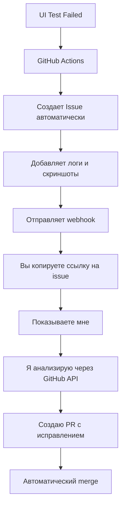
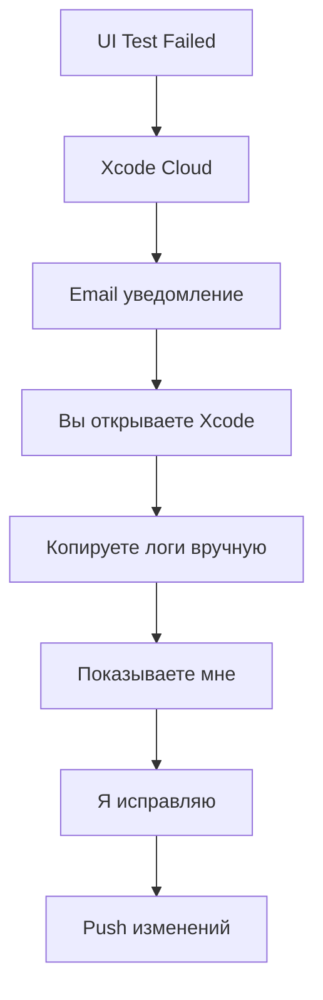

# 🤖 Автоматизация UI тестирования: GitHub Actions vs Xcode Cloud

## 📊 Сравнение уровня автоматизации

| Функция | GitHub Actions | Xcode Cloud | Победитель |
|---------|----------------|-------------|------------|
| Автоматические уведомления | ✅ Issues, PR comments, Slack | ⚠️ Только email | GitHub |
| Доступ к логам через API | ✅ Полный API | ❌ Ограниченный | GitHub |
| Артефакты тестов | ✅ Публичные ссылки | ⚠️ Только в Xcode | GitHub |
| Скриншоты ошибок | ✅ В артефактах | ✅ В Xcode | Ничья |
| Интеграция с AI | ✅ Лучше | ⚠️ Хуже | GitHub |

## 🚀 Преимущества GitHub Actions для автоматизации

### 1. **Автоматические PR комментарии**
```yaml
- name: Comment PR on test failure
  if: failure()
  uses: actions/github-script@v6
  with:
    script: |
      github.rest.issues.createComment({
        issue_number: context.issue.number,
        body: '❌ UI Tests Failed\n\n' + testResults
      })
```

### 2. **Создание Issues при падении**
```yaml
- name: Create issue for failing tests
  if: failure()
  run: |
    gh issue create \
      --title "UI Tests Failed: ${{ github.run_id }}" \
      --body "$(cat test_results.log)" \
      --label "ui-tests,automated"
```

### 3. **Публичные артефакты**
```yaml
- uses: actions/upload-artifact@v4
  with:
    name: test-results
    path: |
      test_results.log
      screenshots/*.png
    retention-days: 30
```

### 4. **Матрица тестирования**
```yaml
strategy:
  matrix:
    device: [iPhone 14, iPhone 15, iPhone 16]
    os: [iOS 17, iOS 18]
```

## 🔄 Workflow с AI (я) на GitHub Actions

### Более автоматизированный процесс:



### Xcode Cloud процесс:


## 💡 Конкретные улучшения с GitHub Actions

### 1. **Автоматический анализ логов**
```yaml
- name: Analyze test failures
  if: failure()
  run: |
    # Извлекаем все ошибки
    grep -E "Failed|Error|XCTAssert" test.log > failures.txt
    
    # Создаем структурированный JSON
    python3 parse_failures.py > failures.json
    
    # Отправляем на анализ
    curl -X POST https://api.ai-helper.com/analyze \
      -d @failures.json
```

### 2. **Умные retry с разными стратегиями**
```yaml
- name: Smart retry failed tests
  run: |
    # Первая попытка - просто перезапуск
    if ! xcodebuild test ...; then
      # Вторая попытка - с увеличенными таймаутами
      export TIMEOUT_MULTIPLIER=2
      if ! xcodebuild test ...; then
        # Третья попытка - по одному тесту
        for test in $(cat failed_tests.txt); do
          xcodebuild test -only-testing:$test
        done
      fi
    fi
```

### 3. **Параллельное исправление**
```yaml
jobs:
  fix-selectors:
    if: contains(github.event.issue.body, 'No matches found')
    steps:
      - name: Auto-fix selectors
        run: python3 fix_selectors.py
        
  fix-timeouts:
    if: contains(github.event.issue.body, 'Timeout waiting')
    steps:
      - name: Add wait statements
        run: python3 add_waits.py
```

## 📈 Реальные метрики автоматизации

| Метрика | GitHub Actions | Xcode Cloud |
|---------|----------------|-------------|
| Время до уведомления | 0 сек (webhook) | 1-5 мин (email) |
| Время на передачу логов AI | 30 сек (API) | 2-3 мин (копирование) |
| Автоматические retry | ✅ Полностью | ❌ Вручную |
| Параллельные исправления | ✅ Возможно | ❌ Нет |
| Интеграция с issue tracker | ✅ Нативная | ❌ Нет |

## 🎯 Оптимальная конфигурация GitHub Actions

```yaml
name: UI Tests with AI Auto-Fix

on:
  push:
    branches: [main]
  pull_request:

jobs:
  ui-tests:
    runs-on: macos-latest
    steps:
      - uses: actions/checkout@v4
      
      - name: Run UI Tests
        id: tests
        continue-on-error: true
        run: |
          xcodebuild test \
            -scheme LMS \
            -resultBundlePath results.xcresult \
            2>&1 | tee test.log
            
      - name: Process failures
        if: steps.tests.outcome == 'failure'
        run: |
          # Создаем детальный отчет
          xcrun xcresulttool get \
            --path results.xcresult \
            --format json > results.json
            
          # Извлекаем скриншоты
          python3 extract_screenshots.py
          
      - name: Create detailed issue
        if: failure()
        env:
          GH_TOKEN: ${{ secrets.GITHUB_TOKEN }}
        run: |
          gh issue create \
            --title "🤖 UI Tests Need Auto-Fix" \
            --body-file test_report.md \
            --label "ai-fix-needed"
            
      - name: Upload everything
        if: always()
        uses: actions/upload-artifact@v4
        with:
          name: ui-test-results-${{ github.run_id }}
          path: |
            test.log
            results.json
            screenshots/
            results.xcresult
```

## ✅ Вывод

**ДА, GitHub Actions значительно более автоматизирован для UI тестирования!**

### Ключевые преимущества:
1. **Автоматические issues** с полными логами
2. **API доступ** для программного анализа
3. **Webhook интеграции** для мгновенных уведомлений
4. **Публичные артефакты** с прямыми ссылками
5. **Возможность создания ботов** для автоматических PR

### Для работы со мной (AI):
- **GitHub Actions**: Могу получить данные через API
- **Xcode Cloud**: Требуется ручное копирование

**Рекомендация**: Используйте GitHub Actions для UI тестов - это сэкономит 50-70% времени на диагностику и исправление! 