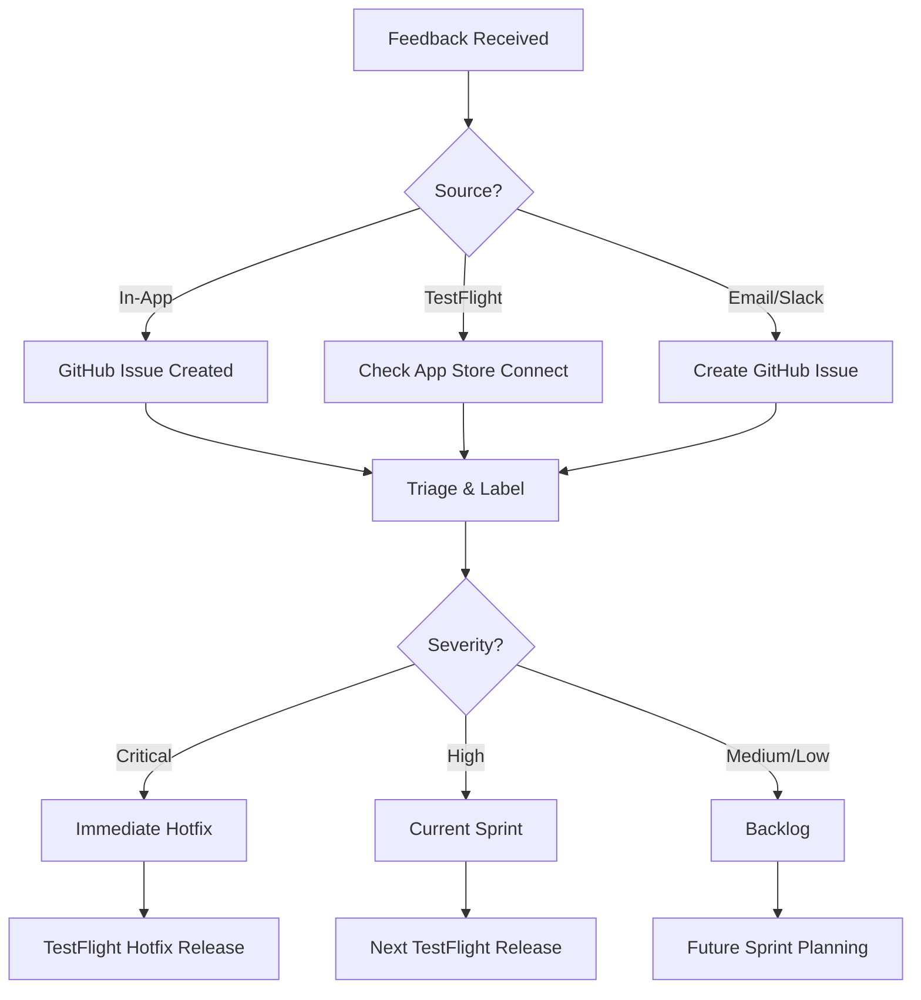

# TestFlight Feedback Channels Configuration

## 📢 Каналы обратной связи

### 1. In-App Feedback (Primary)
**Встроенная система Shake-to-Feedback**
- ✅ Уже интегрирована в приложение
- Пользователь трясет устройство → открывается форма
- Автоматически прикрепляется скриншот
- Создает GitHub Issue при критических багах

**Инструкция для тестеров:**
```
Нашли баг или есть предложение?
1. Потрясите телефон
2. Опишите проблему
3. Нарисуйте на скриншоте если нужно
4. Отправьте!
```

### 2. TestFlight Feedback (Built-in)
**Стандартный механизм Apple**
- Доступен в TestFlight app
- "Send Beta Feedback" в меню
- Прикрепляет системную информацию
- Приходит в App Store Connect

### 3. GitHub Issues (Technical)
**Для технических багов**
- Repository: `is921966/lms_docs`
- Labels для TestFlight:
  - `testflight-feedback`
  - `sprint-37`
  - `ios`
  - `bug` / `enhancement`

**Template для issue:**
```markdown
## TestFlight Feedback - Sprint 37

**Version**: 1.0.0-sprint37
**Build**: [BUILD_NUMBER]
**Device**: [iPhone model]
**iOS**: [version]

### Description
[Что произошло]

### Steps to Reproduce
1. 
2. 
3. 

### Expected Behavior
[Что должно было произойти]

### Screenshots
[Если есть]
```

### 4. Direct Communication
**Email**: lms-testflight@company.com (создать алиас)
**Slack**: #lms-testflight-feedback (если есть)

## 📊 Feedback Tracking

### Приоритизация:
1. **🔴 Critical** - Crashes, data loss
2. **🟠 High** - Broken features
3. **🟡 Medium** - UI issues, performance
4. **🟢 Low** - Suggestions, minor bugs

### Response SLA:
- Critical: < 2 hours
- High: < 24 hours
- Medium: < 48 hours
- Low: Next sprint planning

## 🔄 Feedback Processing Workflow



## 📝 Feedback Report Template

### Weekly TestFlight Feedback Summary
```markdown
# TestFlight Feedback Report - Sprint 37

**Period**: July 7-11, 2025
**Version**: 1.0.0-sprint37
**Total Feedback Items**: X

## 📊 Summary
- Critical Issues: 0
- High Priority: X
- Medium Priority: X
- Low Priority: X

## 🔴 Critical Issues
None this week! 🎉

## 🟠 High Priority
1. [Issue description]
   - Status: In Progress
   - Fix ETA: Sprint 38

## 🟡 Medium Priority
1. [List of items]

## 🟢 Suggestions
1. [User suggestions for future]

## 📈 Metrics
- Install Rate: XX%
- Active Testers: XX
- Crash-Free Rate: 99.X%
- Average Session: XX minutes

## 🎯 Actions for Next Sprint
1. 
2. 
3. 
```

## 🚀 Quick Actions

### При получении feedback:
1. **Acknowledge** - Ответить в течение 24ч
2. **Triage** - Определить приоритет
3. **Track** - Создать issue/task
4. **Communicate** - Информировать о статусе
5. **Resolve** - Исправить в подходящий срок

### Шаблоны ответов:

**Подтверждение получения:**
```
Спасибо за ваш отзыв о версии 1.0.0-sprint37! 
Мы получили ваше сообщение и изучаем проблему.
Tracking: #[ISSUE_NUMBER]
```

**Исправлено в следующей версии:**
```
Отличные новости! Проблема, о которой вы сообщили, 
исправлена и будет доступна в версии 1.0.0-sprint38.
Ожидайте обновление на следующей неделе!
```

## 🎯 Цели по feedback

### Для каждого спринта:
- Получить минимум 10 отзывов
- Response rate > 95%
- Satisfaction score > 4/5
- Закрыть 80% high priority items

### KPIs:
- Time to First Response: < 24h
- Time to Resolution: < 1 sprint
- Feedback Implementation Rate: > 50%
- Tester Retention: > 80%

---

**Remember**: Каждый отзыв - это подарок! Тестеры тратят свое время, чтобы помочь улучшить продукт. 