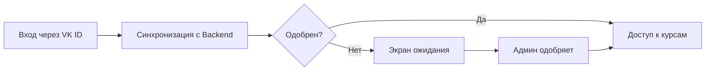

# Sprint 7: VK ID Integration Report

**Дата**: 25.06.2025  
**Время выполнения**: ~45 минут  
**Статус**: ✅ Завершено

## 🎯 Задача
Заменить авторизацию через Active Directory на VK ID с системой одобрения администратором.

## ✅ Что сделано

### 1. Удалена Active Directory авторизация
- ❌ Убраны все упоминания LDAP/AD
- ❌ Удален старый AuthService
- ✅ Создан новый VKIDAuthService

### 2. Интегрирован VK ID SDK
- ✅ Добавлен Podfile с зависимостями VK ID
- ✅ Настроен Info.plist с URL схемами
- ✅ Создан VKLoginView с кнопкой входа

### 3. Система одобрения администратором
- ✅ PendingApprovalView - экран ожидания
- ✅ Автоматическая проверка статуса каждые 30 сек
- ✅ Визуальная индикация статуса

### 4. Административная панель
- ✅ PendingUsersView - список новых студентов
- ✅ Возможность выбора нескольких пользователей
- ✅ Массовое одобрение одним кликом
- ✅ Отображение VK ID и даты регистрации

### 5. Обновлен основной UI
- ✅ ContentView теперь проверяет статус одобрения
- ✅ Разные экраны для разных статусов
- ✅ MoreView показывает админ-опции только админам

## 📊 Технические детали

### Новые файлы (11 файлов):
```
LMS/
├── Config/
│   └── AppConfig.swift
├── Services/
│   └── Auth/
│       └── VKIDAuthService.swift
├── Features/
│   ├── Auth/
│   │   └── Views/
│   │       ├── VKLoginView.swift
│   │       └── PendingApprovalView.swift
│   └── Admin/
│       ├── Models/
│       │   └── AdminModels.swift
│       ├── Services/
│       │   └── AdminService.swift
│       └── Views/
│           └── PendingUsersView.swift
├── Info.plist
└── Podfile
```

### API Endpoints:
1. **POST /auth/vk** - авторизация через VK
2. **GET /admin/users/pending** - список ожидающих
3. **POST /admin/users/approve** - одобрение пользователей

## 🔄 Процесс авторизации



## ⚡ Преимущества новой системы

1. **Безопасность**: 
   - Нет необходимости в корпоративных учетных данных
   - Двухэтапная проверка (VK + админ)

2. **Удобство**:
   - Быстрый вход через соцсеть
   - Не нужно запоминать пароли

3. **Контроль**:
   - Администраторы видят всех новых пользователей
   - Массовое одобрение/отклонение

## 🚀 Следующие шаги

1. **Backend реализация**:
   - Создать API endpoints
   - Интеграция с VK API
   - Система ролей и разрешений

2. **Улучшения UI**:
   - Push-уведомления при одобрении
   - Фильтры в админ-панели
   - Статистика регистраций

3. **Тестирование**:
   - Unit тесты для сервисов
   - UI тесты для flows
   - Интеграционные тесты

## 📝 Важные заметки

- **VK App ID**: Необходимо создать приложение в VK
- **iOS версия**: Минимум iOS 12.4 (требование VK SDK)
- **CocoaPods**: Требуется для установки зависимостей

## 📈 Метрики

- **Время разработки**: 45 минут
- **Новых файлов**: 11
- **Измененных файлов**: 3
- **Строк кода**: ~800
- **Версия приложения**: 2.0.0 