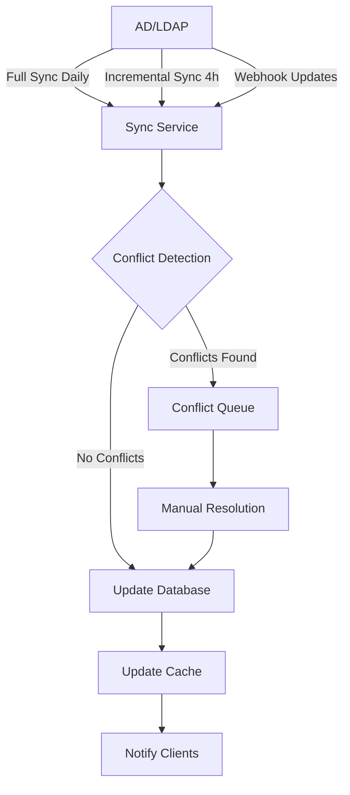

# Техническое задание Sprint 49: Unified Employee & User Management

## 1. Модель данных

### 1.1 Core Entities

```swift
// Employee - центральная сущность системы
struct Employee: Identifiable, Codable {
    let id: String
    let tabNumber: String // Уникальный табельный номер
    let personalInfo: PersonalInfo
    let employmentInfo: EmploymentInfo
    let organizationalInfo: OrganizationalInfo
    let userAccount: UserAccount?
    let competencyProfile: CompetencyProfile?
    let metadata: EmployeeMetadata
    
    struct PersonalInfo: Codable {
        let firstName: String
        let lastName: String
        let middleName: String?
        let birthDate: Date?
        let photoURL: URL?
        let personalEmail: String?
        let personalPhone: String?
    }
    
    struct EmploymentInfo: Codable {
        let hireDate: Date
        let employmentType: EmploymentType
        let workSchedule: WorkSchedule
        let status: EmployeeStatus
        let terminationDate: Date?
        let probationEndDate: Date?
    }
    
    struct OrganizationalInfo: Codable {
        let position: Position
        let department: Department
        let manager: EmployeeReference?
        let functionalManager: EmployeeReference?
        let officeLocation: String?
        let workEmail: String
        let workPhone: String?
        let internalPhone: String?
    }
}

// UserAccount - учетная запись в системе
struct UserAccount: Identifiable, Codable {
    let id: String
    let employeeId: String
    let email: String
    let username: String
    let adUsername: String?
    let authProvider: AuthProvider
    let roles: [Role]
    let permissions: Set<Permission>
    let accountStatus: AccountStatus
    let securitySettings: SecuritySettings
    let activityInfo: ActivityInfo
    
    struct SecuritySettings: Codable {
        let twoFactorEnabled: Bool
        let passwordLastChanged: Date
        let mustChangePassword: Bool
        let loginAttempts: Int
        let lockedUntil: Date?
    }
    
    struct ActivityInfo: Codable {
        let createdAt: Date
        let lastLoginAt: Date?
        let lastActivityAt: Date?
        let lastLoginIP: String?
        let lastUserAgent: String?
        let totalLoginCount: Int
    }
}
```

### 1.2 Database Schema

```sql
-- Employees table (объединяет users и org_employees)
CREATE TABLE employees (
    id UUID PRIMARY KEY DEFAULT gen_random_uuid(),
    tab_number VARCHAR(20) UNIQUE NOT NULL,
    
    -- Personal info
    first_name VARCHAR(100) NOT NULL,
    last_name VARCHAR(100) NOT NULL,
    middle_name VARCHAR(100),
    birth_date DATE,
    photo_url VARCHAR(500),
    personal_email VARCHAR(255),
    personal_phone VARCHAR(20),
    
    -- Employment info
    hire_date DATE NOT NULL,
    employment_type VARCHAR(50) NOT NULL,
    work_schedule VARCHAR(50) DEFAULT 'full_time',
    status VARCHAR(50) NOT NULL DEFAULT 'active',
    termination_date DATE,
    probation_end_date DATE,
    
    -- Organizational info
    position_id UUID NOT NULL,
    department_id UUID NOT NULL,
    manager_id UUID REFERENCES employees(id),
    functional_manager_id UUID REFERENCES employees(id),
    office_location VARCHAR(255),
    work_email VARCHAR(255) NOT NULL,
    work_phone VARCHAR(20),
    internal_phone VARCHAR(10),
    
    -- System fields
    created_at TIMESTAMP DEFAULT CURRENT_TIMESTAMP,
    updated_at TIMESTAMP DEFAULT CURRENT_TIMESTAMP,
    created_by UUID,
    updated_by UUID,
    
    -- Indexes
    INDEX idx_employees_tab_number (tab_number),
    INDEX idx_employees_status (status),
    INDEX idx_employees_department (department_id),
    INDEX idx_employees_position (position_id),
    INDEX idx_employees_manager (manager_id),
    INDEX idx_employees_search (last_name, first_name, tab_number)
);

-- User accounts table
CREATE TABLE user_accounts (
    id UUID PRIMARY KEY DEFAULT gen_random_uuid(),
    employee_id UUID NOT NULL REFERENCES employees(id),
    email VARCHAR(255) UNIQUE NOT NULL,
    username VARCHAR(100) UNIQUE NOT NULL,
    ad_username VARCHAR(100) UNIQUE,
    auth_provider VARCHAR(50) NOT NULL DEFAULT 'local',
    
    -- Security
    password_hash VARCHAR(255),
    two_factor_enabled BOOLEAN DEFAULT FALSE,
    two_factor_secret VARCHAR(255),
    password_last_changed TIMESTAMP,
    must_change_password BOOLEAN DEFAULT FALSE,
    login_attempts INT DEFAULT 0,
    locked_until TIMESTAMP,
    
    -- Activity
    created_at TIMESTAMP DEFAULT CURRENT_TIMESTAMP,
    last_login_at TIMESTAMP,
    last_activity_at TIMESTAMP,
    last_login_ip INET,
    last_user_agent TEXT,
    total_login_count INT DEFAULT 0,
    
    -- Status
    account_status VARCHAR(50) NOT NULL DEFAULT 'active',
    email_verified_at TIMESTAMP,
    
    -- Indexes
    INDEX idx_user_accounts_employee (employee_id),
    INDEX idx_user_accounts_status (account_status),
    INDEX idx_user_accounts_ad_username (ad_username)
);
```

## 2. API Endpoints

### 2.1 Employee Management

```yaml
# Employee CRUD
GET    /api/v2/employees
POST   /api/v2/employees
GET    /api/v2/employees/{id}
PUT    /api/v2/employees/{id}
DELETE /api/v2/employees/{id}

# Employee relationships
GET    /api/v2/employees/{id}/subordinates
GET    /api/v2/employees/{id}/manager
GET    /api/v2/employees/{id}/team
GET    /api/v2/employees/{id}/department-colleagues

# Employee account
GET    /api/v2/employees/{id}/account
POST   /api/v2/employees/{id}/create-account
PUT    /api/v2/employees/{id}/account
DELETE /api/v2/employees/{id}/account

# Bulk operations
POST   /api/v2/employees/bulk-import
POST   /api/v2/employees/bulk-update
POST   /api/v2/employees/bulk-create-accounts
```

### 2.2 Organization Structure

```yaml
# Structure navigation
GET    /api/v2/organization/structure
GET    /api/v2/organization/departments/{id}/employees
GET    /api/v2/organization/positions/{id}/employees
GET    /api/v2/organization/chart

# Structure management
POST   /api/v2/organization/departments/{id}/move-employees
POST   /api/v2/organization/employees/{id}/change-manager
POST   /api/v2/organization/restructure
```

### 2.3 AD Synchronization

```yaml
# Sync operations
POST   /api/v2/sync/ad/full
POST   /api/v2/sync/ad/incremental
POST   /api/v2/sync/ad/employee/{adUsername}
GET    /api/v2/sync/status
GET    /api/v2/sync/history
GET    /api/v2/sync/conflicts
POST   /api/v2/sync/conflicts/{id}/resolve
```

## 3. iOS Implementation

### 3.1 View Structure

```
EmployeeManagementView
├── EmployeeListView
│   ├── FilterBar
│   ├── SearchBar
│   ├── EmployeeRow
│   └── BulkActionsToolbar
├── EmployeeDetailView
│   ├── PersonalInfoTab
│   ├── AccountTab
│   ├── OrganizationTab
│   ├── AccessRightsTab
│   └── HistoryTab
├── CreateEmployeeView
│   ├── BasicInfoForm
│   ├── PositionSelector
│   ├── ManagerSelector
│   └── AccountCreationOptions
└── ImportEmployeesView
    ├── FileUploader
    ├── ColumnMapper
    ├── DataPreview
    └── ImportProgress
```

### 3.2 Services Architecture

```swift
// Main service for employee management
class EmployeeManagementService: ObservableObject {
    @Published var employees: [Employee] = []
    @Published var isLoading = false
    @Published var syncStatus: SyncStatus?
    
    private let apiClient: EmployeeAPIClient
    private let adSyncService: ADSyncService
    private let cacheManager: EmployeeCacheManager
    
    // Core operations
    func loadEmployees(filter: EmployeeFilter? = nil) async
    func createEmployee(_ data: CreateEmployeeData) async throws -> Employee
    func updateEmployee(_ id: String, data: UpdateEmployeeData) async throws
    func createUserAccount(for employeeId: String) async throws -> UserAccount
    
    // Bulk operations
    func importEmployees(from file: URL) async throws -> ImportResult
    func bulkCreateAccounts(for employeeIds: [String]) async throws
    
    // Sync operations
    func syncWithAD(mode: SyncMode) async throws -> SyncResult
    func resolveSyncConflicts(_ conflicts: [SyncConflict]) async throws
}
```

## 4. Sync Strategy

### 4.1 AD Integration Flow



### 4.2 Field Mapping

```swift
struct ADFieldMapping {
    // AD -> Employee mapping
    static let fieldMap = [
        "sAMAccountName": "adUsername",
        "givenName": "firstName",
        "sn": "lastName",
        "displayName": "displayName",
        "mail": "workEmail",
        "telephoneNumber": "workPhone",
        "department": "departmentName",
        "title": "positionTitle",
        "manager": "managerDN",
        "employeeID": "tabNumber",
        "physicalDeliveryOfficeName": "officeLocation"
    ]
}
```

## 5. Import Enhancement

### 5.1 Smart Import Features

- Auto-detection of file format (Excel, CSV)
- Intelligent column mapping with ML suggestions
- Data validation and enrichment
- Duplicate detection
- Automatic account creation
- Email notifications

### 5.2 Import Process

```swift
enum ImportStep {
    case fileUpload
    case formatDetection
    case columnMapping
    case dataValidation
    case conflictResolution
    case preview
    case processing
    case complete(ImportResult)
}

struct ImportResult {
    let employeesCreated: Int
    let employeesUpdated: Int
    let accountsCreated: Int
    let errors: [ImportError]
    let warnings: [ImportWarning]
    let duration: TimeInterval
}
```

## 6. Testing Requirements

### 6.1 Unit Tests
- Employee model validation
- AD sync field mapping
- Import data parsing
- Permission calculations
- Search and filtering

### 6.2 Integration Tests
- Full AD sync simulation
- Bulk import with 1000+ records
- Concurrent updates handling
- Cache consistency
- API error handling

### 6.3 UI Tests
- Employee creation flow
- Bulk selection and actions
- Search functionality
- Import wizard
- Sync status monitoring

## 7. Performance Requirements

- Load 1000+ employees < 2 seconds
- Search response < 100ms
- AD sync for 5000 employees < 5 minutes
- Import 1000 records < 30 seconds
- Real-time updates via WebSocket

## 8. Security Considerations

- Role-based access to employee data
- Audit trail for all changes
- PII data encryption
- Secure AD credential storage
- Session management
- API rate limiting

## 9. Migration Plan

1. Backup existing data
2. Create new tables
3. Migrate users -> employees
4. Link org_employees -> employees
5. Create user_accounts from users
6. Verify data integrity
7. Switch to new API
8. Deprecate old endpoints 